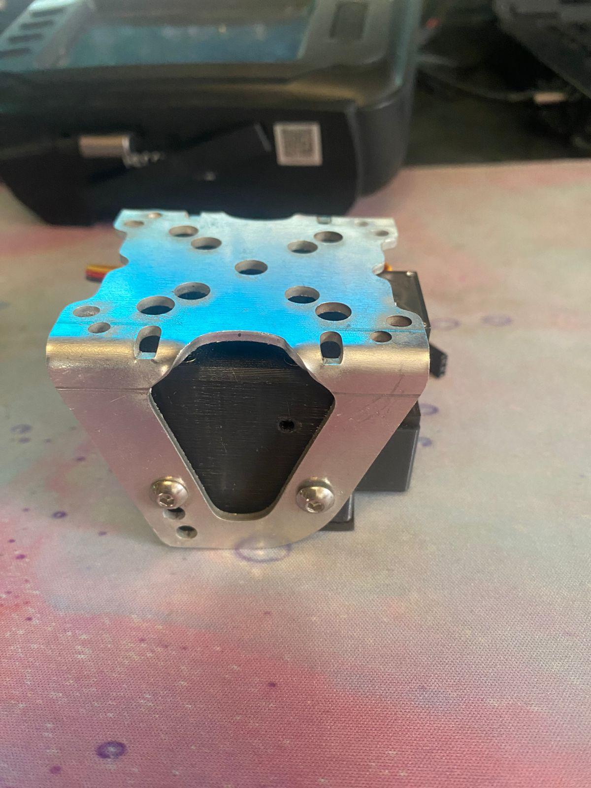
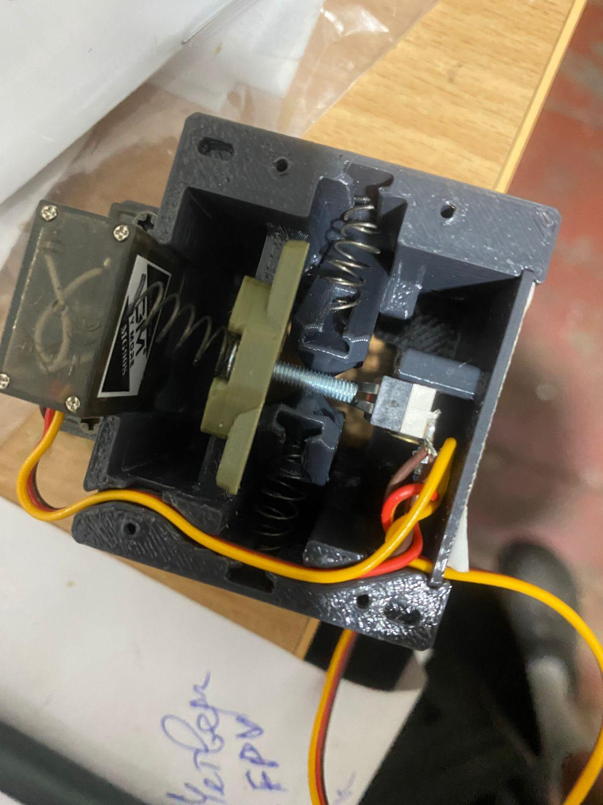
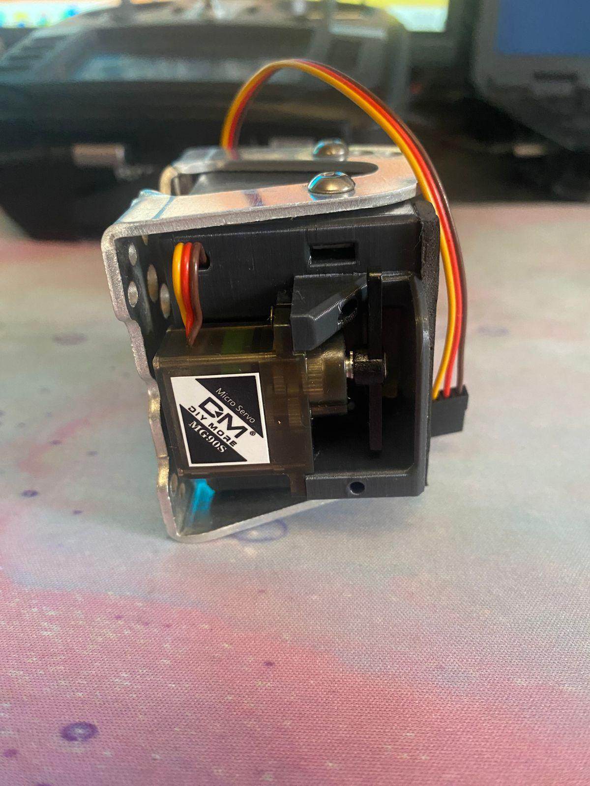
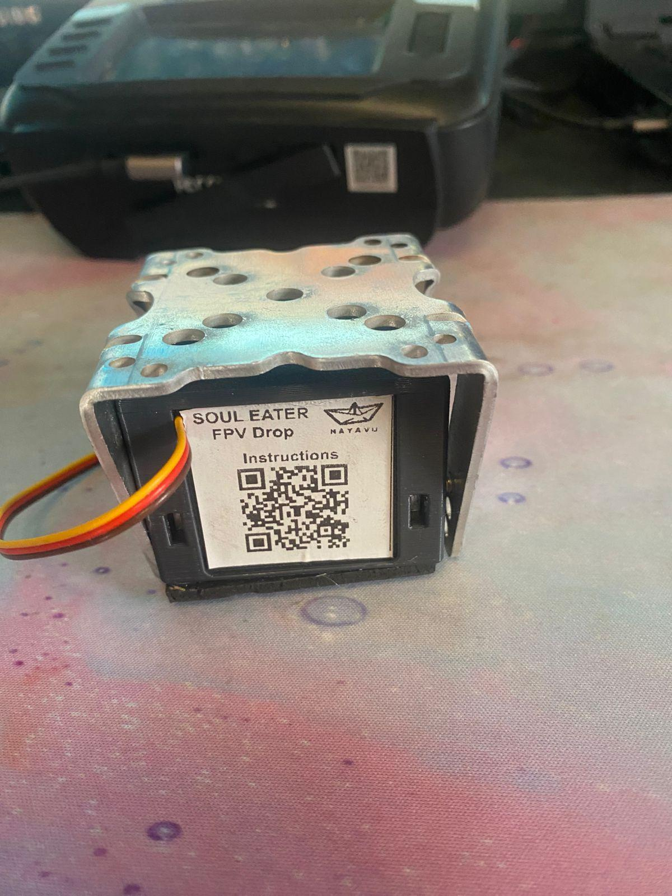

# Nayavu

## Images

---

Скидання до 15 кг Soul Eater Пожирач душ для FPV на рамах XL10, Mark 4, Lucky Strike або інших адаптерів - повний комплект
Сучасна система скидання, розроблена для FPV-дронів, забезпечує надійне транспортування і точне скидання вантажів у різних умовах. Підключається безпосередньо до польотного контролера без потреби в BEC. Має велику вантажопідйомність і широкі можливості налаштування. Детальніше: https://nayavu.com.ua/ua/p2711292205-sbros-15kg-soul.html

LUCKY STRIKE АБО ІНШИХ АДАПТЕРІВ
Каталог
Контакти
Відгуки
Статті
Контакти
+380 (93) 211-62-42
https://nayavu.prom.ua
military@nayavu.com.ua
https://t.me/nayavu_drones
+380932116242
+380932116242
Instagram
https://www.instagram.com/nayavu_drones
Youtube
https://www.youtube.com/@nayavu1043
Facebook
https://www.facebook.com/people/Nayavu-Additive-manufacturer/100086177952916/
Ви переглядали

Скидання до 15 кг Soul Eater Пожирач душ для FPV на рамах XL10, Mark 4, Lucky Strike або інших адаптерів
985 ₴

Кріплення БП для скиду Soul Eater Пожирач душ від NAYAVU Drones - стандартна універсальна версія
15 ₴
Ми рекомендуємо

Скид до 15кг для FPV дронів на рамах XL10, Mark 4, Lucky Strike або інших адаптерів Soul Eater
1 280 ₴

Скид для FPV дрону на рамах XL10, Mark 4, Lucky Strike до 15 кг корисного навантаження
1 280 ₴

Універсальна система скидання до 15кг Soul Eater Пожежник душ для FPV на рамах XL10, Mark 4, Lucky Strike
1 280 ₴

Система скидання до 15 кг для FPV дронів на рамах XL10, Mark 4, Lucky Strike або інших адаптерів
1 280 ₴

Скид до 15 кг Soul Eater Пожирач душ для FPV на рамах XL10, Mark 4, Lucky Strike або інших адаптерів
1 280 ₴

Система скидання до 15 кг для FPV на рамах XL10, Mark 4, Lucky Strike або інших адаптерів Soul Eater
985 ₴

Універсальний Скид до 15 кг Пожирач душ для FPV на рамах XL10, Mark 4, Lucky Strike або інших адаптерів
985 ₴

Скидання для FPV до 15 кг навантаження на рамах XL10, Mark 4, Lucky Strike або інших адаптерів
985 ₴

Скид універсальний для FPV дрону на рамах XL10, Mark 4, Lucky Strike з навантаженням до 15 кг
985 ₴

Скидання до 15 кг Soul Eater Пожирач душ для FPV на рамах XL10, Mark 4, Lucky Strike або інших адаптерів
985 ₴

1 280 ₴

Готово до відправки
Код: SE_drop (full)
Купити
Купити з
Що таке купити з Пром?
Замовлення під захистом 
+380 (93) 211-62-42
Умови оплати та доставки Графік роботи Адреса та контакти
повернення товару протягом 14 днів за домовленістюДетальніше

Скид до 15 кг Soul Eater Пожирач душ для FPV на рамах XL10, Mark 4, Lucky Strike або інших адаптерів
1 280 ₴
Готово до відправки
Купити
Купити з
+380 (93) 211-62-42
Опис	Характеристики	Інформація для замовлення
Скидання до 15 кг Soul Eater Пожирач душ для FPV на рамах XL10, Mark 4, Lucky Strike або інших адаптерів - повний комплект
Сучасна система скидання, розроблена для FPV-дронів, забезпечує надійне транспортування і точне скидання вантажів у різних умовах. Підключається безпосередньо до польотного контролера без потреби в BEC. Має велику вантажопідйомність і широкі можливості налаштування.

Технічні характеристики:

Вага: 106 г

Живлення: від польотного контролера - без необхідності BEC

Споживання струму: 50–100 мА, до 800 мА короткочасно під час скидання

Максимальне навантаження на одну позицію: до 15 кг

Регулювання кута нахилу скидання: 0–25 градусів

Світлодіодна індикація правильної установки БП

Сумісність: рами XL10, Mark4, LuckyStrike

Можливість встановлення на інші рами за допомогою адаптера (під запит)

Комплектація (роздрібна/тестова):

Система скидання

Кронштейн

Гвинти для кріплення скидання – 6 шт

Гвинти для кріплення кронштейна – 6 шт

Шестигранники 2 мм та 2.5 мм

Кріплення БП – 10 шт

Нейлонові стяжки – 40 шт

Запасні вспінені накладки – 4 шт

Комплектація (оптова):

Система скидання

Кронштейн (від 100 шт можливе виготовлення індивідуальних під конкретні рами)

Гвинти для кріплення скидання – 6 шт

Гвинти для кріплення кронштейна – 6 шт

### Кріплення БП можна замовити окремо за собівартістю — 15 грн/шт (без знижки на кількість). Детальніше: https://nayavu.com.ua/ua/p2711292205-sbros-15kg-soul.html
